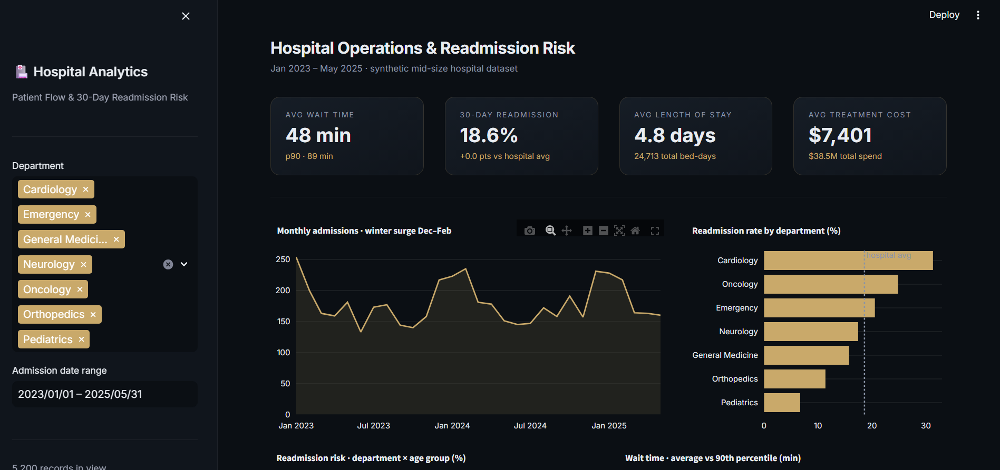

# 🏥 Hospital Patient Flow & Readmission Risk Analysis

    

An end-to-end **healthcare analytics** project: from a messy raw hospital export to a cleaned dataset, SQL analysis, statistical deep-dives, an interpretable readmission risk score, and an interactive operations dashboard.

---

## 📸 Dashboard Preview



---

## 📋 Business Problem

A mid-size hospital faces three linked operational questions:

1. **Readmissions:** which departments and patient cohorts drive avoidable 30-day readmissions, and what do they cost?
2. **Capacity:** how seasonal is admission demand, and where does bed-day pressure concentrate?
3. **Patient experience:** where are wait times worst, and is it a volume problem or a process problem?

---

## 📊 Dataset

~5,200 synthetic admission records (Jan 2023 – May 2025) generated with realistic statistical structure: department case mix, winter admission surges, age-driven readmission risk, log-normal cost distributions. Real patient data is protected (HIPAA/DPDP), so the generator recreates the patterns **and the mess**: duplicate registrations, mixed date formats, inconsistent gender encodings, missing values and impossible (negative) wait times — all handled in a documented cleaning pipeline.

---

## 🔍 Key Insights

- **Cardiology shows a ~28% 30-day readmission rate vs a ~16% hospital average** — and being high-volume + high-cost, it is the largest readmission cost pool.
- **Age 65+ adds ~8 percentage points of readmission risk in every department**; the 65+ × Cardiology cohort is the single riskiest segment.
- **Winter admissions run ~30–40% above summer**, with bed-day pressure concentrated in Cardiology and Oncology.
- **P90 waits are ~2× the average** in the slowest departments — a triage/process issue, not just volume.
- An interpretable **logistic regression risk score** confirms department and age as dominant drivers and provides a usable discharge-triage tool.

Full business-style write-up: [`docs/INSIGHTS.md`](docs/INSIGHTS.md)

---

## 🗂️ Project Structure

```
├── data/
│   ├── raw/                              # generated raw export (gitignored)
│   └── processed/                        # cleaned dataset (gitignored)
├── scripts/
│   ├── generate_data.py                  # synthetic data generator (seeded, reproducible)
│   └── clean_data.py                     # shared cleaning pipeline (single source of truth)
├── sql/
│   └── analysis_queries.sql              # 10 commented analysis queries (SQLite)
├── notebooks/
│   ├── 01_data_cleaning.ipynb            # audit + documented cleaning decisions
│   ├── 02_exploratory_analysis.ipynb     # seasonality, waits, cost, bed-days
│   └── 03_readmission_analysis.ipynb     # cohorts + logistic risk score
├── dashboard/
│   └── app.py                            # interactive Streamlit + Plotly dashboard
└── docs/
    ├── dashboard_screenshot.png          # dashboard preview image
    └── INSIGHTS.md                       # executive summary & recommendations
```

---

## 🚀 How to Run

```bash
# 1. Clone & setup
git clone https://github.com/arushirrathore/healthcare-analytics.git
cd healthcare-analytics
pip install -r requirements.txt

# 2. Generate the raw dataset (seeded — fully reproducible)
python scripts/generate_data.py

# 3. Run the cleaning pipeline
python scripts/clean_data.py

# 4. Explore the notebooks
jupyter notebook notebooks/

# 5. Launch the dashboard
streamlit run dashboard/app.py
```

For the SQL analysis, load the cleaned CSV into SQLite:

```bash
sqlite3 hospital.db
.mode csv
.import data/processed/hospital_admissions_clean.csv admissions
.read sql/analysis_queries.sql
```

---

## 🛠️ Tech Stack

| Layer | Tools |
|---|---|
| Data wrangling | Python · pandas · NumPy |
| Visualisation | matplotlib · seaborn · Plotly |
| Dashboard | Streamlit |
| Machine learning | scikit-learn (Logistic Regression) |
| Database | SQL · SQLite |
| Notebooks | Jupyter |

---

## 📝 Methodology Highlights

- Every cleaning decision is **documented with rationale** in notebook 01 (e.g., department-median imputation for wait times instead of a biased global median).
- Notebooks and dashboard share **one cleaning module** (`scripts/clean_data.py`) so numbers never disagree.
- The risk model is **deliberately interpretable** — clinical stakeholders need readable coefficients, not a black box.

---

## 👩‍💻 Author

**Arushi Rathore** · BCA 2026 · [GitHub](https://github.com/arushirrathore)
